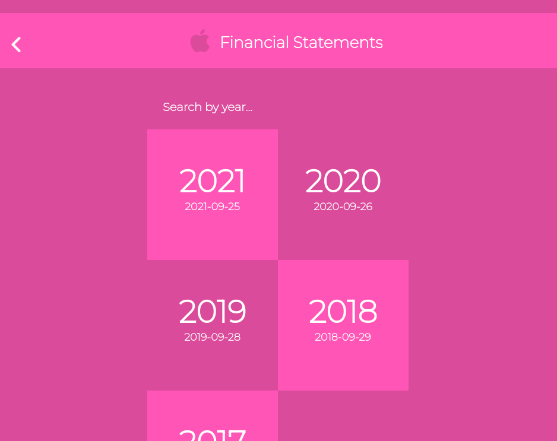

# Apple Income Statements

This is a project developed in React and Redux, that uses the [Financial Modeling Prep API](https://site.financialmodelingprep.com/developer/docs) to create a single page application that display each Apple income statement of the last 5 years. 

## Acknowledgements

The design was inspired by Nelson Sakwa's [design](https://www.behance.net/gallery/31579789/Ballhead-App-(Free-PSDs)).

## Screenshot

## Live Demo & Video Explanation

[Live Demo](https://apple-financial-statements.netlify.app/)
[YouTube Link](https://youtu.be/p38tW-5i3-8)

## Built With

- HTML 
- CSS 
- JavaScript
- React
- Redux
- Jest
- Netlify

## Getting Started

To get a local copy up and running follow the instructions.

### Setup

1. Open the terminal and clone the project using `git clone git@github.com:fabianofrank/apple-income.git`

### Install

1. `cd` into the project folder and run `npm install`
2. Run the command `npm start`

### Run tests

1. Run the command `npm test`

## Author

👤 **Fabiano Frank**

- GitHub: [@fabianofrank](https://github.com/fabianofrank)
- Twitter: [@fabianofrankk](https://twitter.com/fabianofrankk)
- LinkedIn: [LinkedIn](https://www.linkedin.com/in/fabianofrank/)

## 🤝 Contributing

Contributions, issues, and feature requests are welcome!

Feel free to check the [issues page](../../issues/).

## Show your support

Give a ⭐️ if you like this project!

## 📝 License

This project is [MIT](./MIT.md) licensed.
